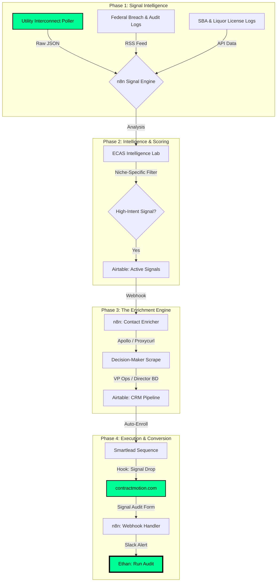

# ContractMotion Engine: Technical Architecture & GTM Workflow
**Project:** Enterprise Contract Acquisition System (ECAS)
**Objective:** Capture high-ticket service contracts ($500K+) by weaponizing information asymmetry.

---

## 1. Executive Summary
ContractMotion is a signal-driven lead generation engine that identifies enterprise-level infrastructure and compliance projects 12–18 months before formal procurement (RFPs) begins. By monitoring "upstream" government and utility signals (FERC interconnection queues, HHS breach filings, bankruptcy liquidations), we position our clients as the preferred technical choice during the pre-FEED (Front-End Engineering Design) phase, effectively closing the bid list before competitors are even aware the project exists.

---

## 2. The Signal-to-Contract Workflow

---

## 3. Phase-by-Phase Technical Specifications

### Phase 1: Signal Intelligence (The Snipers)
*   **Mechanism:** Scheduled n8n workflows (`n8n-ferc-sniper.json`) polling public REST APIs and RSS feeds.
*   **Primary Signals:**
    *   **Energy/EPC:** PJM/ERCOT/FERC Interconnection Requests (>100MW load clusters).
    *   **Compliance/Shredding:** HHS OCR "Wall of Shame" (Paper/Film breach reports).
    *   **Industrial:** Liquidation auction portals (BidSpotter) and SBA 7(a) loan approvals (>$500k).

### Phase 2: Intelligence & Scoring (The AI Filter)
*   **Mechanism:** Integration with Claude 3.5 Sonnet to process raw text data against 17-part deep-dive industry research.
*   **Logic:** Signals are scored (1-10) based on project scale, location, and "Window of Opportunity."
*   **Storage:** High-confidence signals (Score > 7) are pushed to **Airtable (Active Signals)**.

### Phase 3: Enrichment Engine (The Matchmaker)
*   **Mechanism:** Automated contact lookup triggered by new Airtable signals.
*   **Tech Stack:** Apollo API for firmographic matching + Proxycurl for personal LinkedIn/Email verification.
*   **The Output:** A "warm" profile of the specific VP of Operations or Compliance Officer responsible for the project.

### Phase 4: Execution & Conversion (The Digital Moat)
*   **Outreach:** Multi-channel sequences (Email/LinkedIn) leading with the "Signal Drop"—specific project queue IDs or breach notification data.
*   **Conversion Spoke:** Traffic is driven to `contractmotion.com`, where the prospect requests a **Free Signal Audit**.
*   **The Close:** Real-time Slack notifications allow Ethan to step in with the audit data to secure the contract.

---

## 4. Key Performance Metrics
| Metric | Industry Average | ContractMotion Engine |
| :--- | :--- | :--- |
| **Lead Time** | 2-4 Months (RFP Stage) | 12-18 Months (Pre-FEED Stage) |
| **Outreach Accuracy** | Low (Generic ICP) | 100% (Signal-to-Project Match) |
| **Competitive Density** | High (Open Bid) | Low (Informal Shortlist) |
| **Typical Contract Value** | $50K - $150K | $500K - $5.0M |

---
*Generated by Ethan Atchley | ContractMotion Industrial Intelligence Lab | May 2026*
