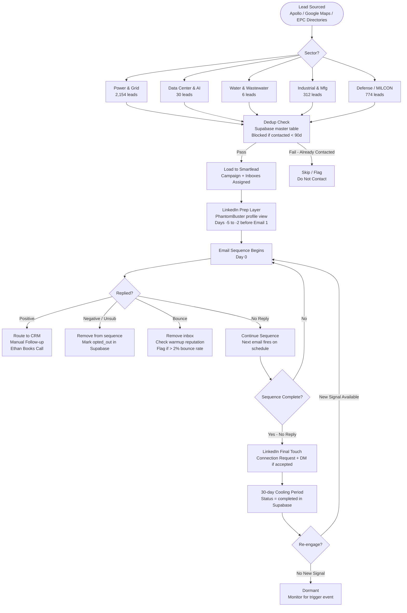
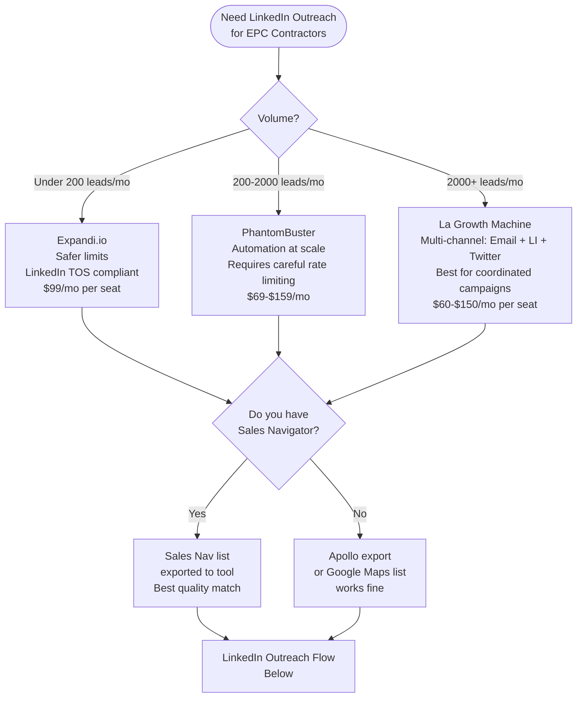
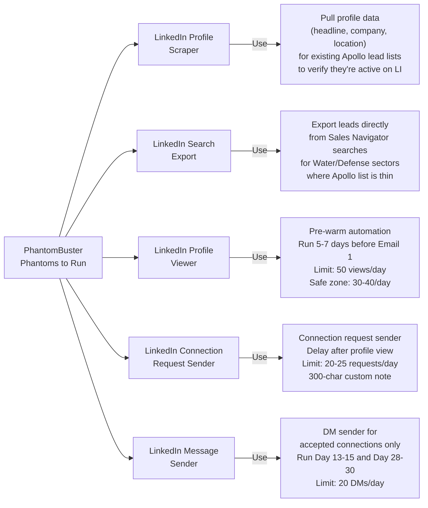
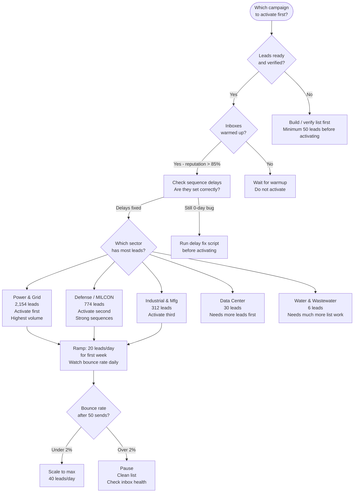

# ContractMotion — Full Campaign Flowcharts & Multi-Channel Sequence Maps

> Built for: EPC Business Development Directors / VP Operations / Presidents  
> Sectors: Power & Grid, Data Center & AI, Water & Wastewater, Industrial & Mfg, Defense/MILCON  
> Channels: Email (Smartlead) + LinkedIn (PhantomBuster/Expandi)

---

## 1. Master Lead Flow — How Every Lead Moves Through the System



---

## 2. Power & Grid — 6-Email Sequence Map

**Campaign ID:** 3005694 | **Leads:** 2,154 | **Status:** PAUSED (never sent)  
**Signals monitored:** FERC interconnection queue, utility RFI filings, transmission project notices  
**ICP:** VP BD, VP Operations, President at T&D / substation EPCs, $20M–$300M revenue, US

```mermaid
flowchart TD
    START([Lead Enters\nPower & Grid Campaign]) --> LI1

    subgraph LINKEDIN_PRE ["LinkedIn Pre-Warm (Days -5 to -1)"]
        LI1[PhantomBuster: View Profile\nTriggers who-viewed-my-profile alert\nCreates familiarity before Email 1]
    end

    LI1 --> E1

    subgraph EMAIL1 ["Day 0 — Signal Hook"]
        E1["Email 1\nSubject: PJM queue item 3847 — transmission rebuild, no RFP yet\n\nHook: Specific FERC/PJM filing in their territory\nAngle: You're watching signals they aren't\nCTA: 'Worth a 20-min look?'"]
    end

    E1 --> R1{Replied?}
    R1 -->|Yes - Positive| WIN([Route to Calendar\nEthan Manual Follow-up])
    R1 -->|Yes - Negative| STOP([Remove from Sequence])
    R1 -->|No| WAIT1[Wait 3-4 Business Days]

    WAIT1 --> LI2

    subgraph LINKEDIN_1 ["LinkedIn Touch 1 (Day 3-4)"]
        LI2[Send LinkedIn Connection Request\nNote: No pitch. Just name + ContractMotion.\nExample: 'Ethan Atchley, ContractMotion — we track pre-RFP\nEPC signals in power & grid. Would love to connect.'"]
    end

    LI2 --> E2

    subgraph EMAIL2 ["Day 4 — Competitor Intelligence"]
        E2["Email 2\nSubject: Why power EPCs keep losing to the same three contractors\n\nHook: The problem is they enter at the RFP stage\nAngle: Short-list forms 12-18 months earlier\nCTA: 'Open to a 10-min call?'"]
    end

    E2 --> R2{Replied?}
    R2 -->|Yes - Positive| WIN
    R2 -->|Yes - Negative| STOP
    R2 -->|No| WAIT2[Wait 5 Business Days]

    WAIT2 --> E3

    subgraph EMAIL3 ["Day 9 — Product Education"]
        E3["Email 3\nSubject: What ContractMotion actually monitors for power EPCs\n\nHook: Specific signals — FERC eLibrary, PJM queue, utility RFIs\nAngle: Demystify the signal engine\nCTA: 'Happy to pull a live feed for your target markets'"]
    end

    E3 --> R3{Replied?}
    R3 -->|Yes - Positive| WIN
    R3 -->|Yes - Negative| STOP
    R3 -->|No| WAIT3[Wait 6 Business Days]

    WAIT3 --> LICHECK{Connected\non LinkedIn?}
    LICHECK -->|Yes| LI3

    subgraph LINKEDIN_2 ["LinkedIn DM 1 (Day 13-15 if connected)"]
        LI3["DM: Pattern Interrupt\n'Hey {{first_name}} — sent you a few emails re: pre-RFP\npower & grid signals. Figured I'd try a different channel.\nWe're tracking 4 new FERC transmission notices this week\nin your geography. Curious if any overlap with your pipeline.'"]
    end

    LICHECK -->|No| E4
    LI3 --> E4

    subgraph EMAIL4 ["Day 15 — Guarantee / Proof"]
        E4["Email 4\nSubject: 2 contracts in 90 days or free\n\nHook: Hard guarantee anchors credibility\nAngle: Risk reversal — they continue free if we don't deliver\nCTA: 'Want me to walk through how the guarantee works?'"]
    end

    E4 --> R4{Replied?}
    R4 -->|Yes - Positive| WIN
    R4 -->|Yes - Negative| STOP
    R4 -->|No| WAIT4[Wait 7 Business Days]

    WAIT4 --> E5

    subgraph EMAIL5 ["Day 22 — Live Signal Drop"]
        E5["Email 5\nSubject: NextEra filed 4 transmission project notices last week\n\nHook: Specific live data point — creates urgency\nAngle: This is what the feed looks like in practice\nCTA: 'If your team is chasing bid packages, I can show\nyou a different model'"]
    end

    E5 --> R5{Replied?}
    R5 -->|Yes - Positive| WIN
    R5 -->|Yes - Negative| STOP
    R5 -->|No| WAIT5[Wait 8 Business Days]

    WAIT5 --> LI4

    subgraph LINKEDIN_3 ["LinkedIn DM 2 (Day 28-30 if connected)"]
        LI4["DM: Breakup Interrupt\n'Last touch from me {{first_name}}. No worries if the\ntiming isn't right — just want to leave the door open.\nIf pre-RFP positioning becomes a priority, we're here.'"]
    end

    LI4 --> E6

    subgraph EMAIL6 ["Day 30 — Breakup Email"]
        E6["Email 6\nSubject: Closing this out\n\nHook: Genuine breakup — not passive aggressive\nAngle: Door stays open, offer stands\nCTA: 'If ContractMotion ever makes sense, my info\nis below'"]
    end

    E6 --> R6{Replied?}
    R6 -->|Yes - Positive| WIN
    R6 -->|No| DONE([Sequence Complete\nCooling Period 30 days\nMonitor for new FERC signals])
```

---

## 3. Data Center & AI — 6-Email Sequence Map

**Campaign ID:** 3040599 | **Leads:** 30 | **Status:** PAUSED  
**Signals:** Hyperscaler interconnection requests, data center permit filings, utility capacity reservations  
**ICP:** EPC contractors doing electrical/MV distribution for hyperscaler campuses


---

## 4. Water & Wastewater — 6-Email Sequence Map

**Campaign ID:** 3040600 | **Leads:** 6 | **Status:** PAUSED (needs more leads)  
**Signals:** SRF loan approvals, EPA WIFIA grants, state PUC filings, municipal infrastructure bonds  
**ICP:** EPC contractors doing water treatment, distribution, sewer infrastructure


---

## 5. Industrial & Manufacturing — 6-Email Sequence Map

**Campaign ID:** 3040601 | **Leads:** 312 | **Status:** PAUSED  
**Signals:** CHIPS Act grant awards, 8-K facility expansion filings, EPA air permits, IRB bond filings  
**ICP:** EPC contractors doing heavy civil, power, mechanical for fabs, gigafactories, LNG, petrochemical

```mermaid
flowchart TD
    START([Lead Enters\nIndustrial & Mfg Campaign]) --> LI1

    subgraph LINKEDIN_PRE ["LinkedIn Pre-Warm (Days -5 to -1)"]
        LI1[Profile View\nIf they posted about CHIPS Act or EV fabs — like it\nCreates warmth before cold email arrives]
    end

    LI1 --> E1

    subgraph EMAIL1 ["Day 0 — 8-K Signal Hook"]
        E1["Email 1\nSubject: 8-K filed — $340M facility expansion, no EPC selected yet\n\nHook: Public SEC filing with dollar scope + geography\nAngle: Pre-FEED is where the short-list forms — before the 8-K\nbecomes an RFP\nCTA: 'Worth a 20-min conversation?'"]
    end

    E1 --> R1{Reply?}
    R1 -->|Positive| WIN([Book Call])
    R1 -->|Negative| STOP([Remove])
    R1 -->|None| W1[+4 days]

    W1 --> LI2

    subgraph LINKEDIN_1 ["Day 3 — Connection Request"]
        LI2["Connection Request\n'Ethan @ ContractMotion — we track CHIPS Act grants, EPA air\npermits, and 8-K filings for industrial EPC contractors before\nRFPs exist. Worth connecting.'"]
    end

    LI2 --> E2

    subgraph EMAIL2 ["Day 4 — Short-List Education"]
        E2["Email 2\nSubject: Why industrial EPCs keep missing the owner's engineer call list\n\nHook: By the time 8-K is news, the owner's engineer already\nhas 3 contractors on speed dial\nAngle: EPC selection starts at CHIPS grant — not at bid\nCTA: 'Open to a quick call?'"]
    end

    E2 --> R2{Reply?}
    R2 -->|Positive| WIN
    R2 -->|Negative| STOP
    R2 -->|None| W2[+5 days]

    W2 --> E3

    subgraph EMAIL3 ["Day 9 — Signal Inventory"]
        E3["Email 3\nSubject: What ContractMotion monitors for industrial contractors\n\nSignals listed: CHIPS Act grants, EPA Title V air permits,\nIRB bond filings, 8-K facility expansions, FERC industrial load apps\nCTA: 'Happy to pull a live demo for your target sectors'"]
    end

    E3 --> R3{Reply?}
    R3 -->|Positive| WIN
    R3 -->|Negative| STOP
    R3 -->|None| W3[+6 days]

    W3 --> LICHECK{Connected\non LinkedIn?}
    LICHECK -->|Yes| LI3
    LICHECK -->|No| E4

    subgraph LINKEDIN_2 ["Day 13-15 — DM if Connected"]
        LI3["DM: Live Pipeline\n'Hey {{first_name}} — flagging 19 IRB filings and 8-K disclosures\ncurrently in our system that haven't entered EPC procurement yet.\nThought it might be relevant to {{company_name}}s BD pipeline.'"]
    end

    LI3 --> E4

    subgraph EMAIL4 ["Day 15 — Guarantee"]
        E4["Email 4\nSubject: 2 contracts in 90 days or free\n\nHook: Guarantee applied to industrial — CHIPS, EV, LNG, petrochem\nAngle: Risk-free trial framing\nCTA: 'Want to walk through how the guarantee works?'"]
    end

    E4 --> R4{Reply?}
    R4 -->|Positive| WIN
    R4 -->|Negative| STOP
    R4 -->|None| W4[+7 days]

    W4 --> E5

    subgraph EMAIL5 ["Day 22 — IRB Count Drop"]
        E5["Email 5\nSubject: Q1 2026 — 31 IRB filings in manufacturing, 24 not yet in procurement\n\nHook: Real Q1 number creates FOMO and specificity\nAngle: These become EPC opportunities in 6-18 months\nCTA: 'If your BD team starts at published bids,\nI can show you a different model'"]
    end

    E5 --> R5{Reply?}
    R5 -->|Positive| WIN
    R5 -->|Negative| STOP
    R5 -->|None| W5[+8 days]

    W5 --> LI4

    subgraph LINKEDIN_3 ["Day 28-30 — Final LinkedIn Touch"]
        LI4["DM: Breakup\n'Last one {{first_name}}. CHIPS Act + IRA manufacturing buildout\nis creating a multi-year EPC runway. We're tracking 19 IRB\nfilings not yet in procurement. Offer stands whenever ready.'"]
    end

    LI4 --> E6

    subgraph EMAIL6 ["Day 30 — Breakup + Leave-Behind"]
        E6["Email 6\nSubject: Leaving this here for {{first_name}}\n\nLeave-behind: Current IRB / CHIPS active project count\nTone: Respectful, door-open, no pressure\nCTA: 'Whenever timing makes sense, my info is below'"]
    end

    E6 --> DONE([Sequence Done\n30-day cooling\nMonitor for new CHIPS grant signals])
```



---

## 6. Defense & Federal Infrastructure — 6-Email Sequence Map

**Campaign ID:** 3095136 | **Leads:** 774 | **Status:** DRAFTED (ready to activate)  
**Signals:** DD Form 1391 filings, FYDP budget items, NAVFAC notices, SAM.gov pre-solicitations  
**ICP:** Federal EPC contractors, MILCON contractors, base infrastructure firms

```mermaid
flowchart TD
    START([Lead Enters\nDefense / MILCON Campaign]) --> LI1

    subgraph LINKEDIN_PRE ["LinkedIn Pre-Warm (Days -5 to -1)"]
        LI1[Profile View\nCheck if they post about MILCON, NAVFAC, federal contracting\nIf yes — engage before reaching out\nNote: Defense contractors are often on LinkedIn less — adjust expectations]
    end

    LI1 --> E1

    subgraph EMAIL1 ["Day 0 — DD Form 1391 Hook"]
        E1["Email 1\nSubject: DD Form 1391 filed in your territory — {{company_name}} does MILCON work?\n\nHook: Specific DoD budget filing with procurement window\nAngle: NAVFAC/ACE selection happens before SAM.gov notice\nPersonalization: Geography match to contractor's known territory\nCTA: 'Worth a 20-minute look?'"]
    end

    E1 --> R1{Reply?}
    R1 -->|Positive| WIN([Book Call])
    R1 -->|Negative| STOP([Remove])
    R1 -->|None| W1[+4 days]

    W1 --> LI2

    subgraph LINKEDIN_1 ["Day 3 — Connection Request"]
        LI2["Connection Request\n'Ethan @ ContractMotion — we track DD Form 1391 filings and\nFYDP-funded MILCON projects before they reach SAM.gov.\nWorth connecting.'"]
    end

    LI2 --> E2

    subgraph EMAIL2 ["Day 4 — Short-List Education"]
        E2["Email 2\nSubject: How most federal contractors find out about MILCON projects\n\nHook: They find out when it posts to SAM.gov — the wrong time\nAngle: NAVFAC pre-solicitation engagement starts 12-18 months earlier\nAt FYDP → active project stage, the contracting officer already\nhas preferred firms in mind\nCTA: 'Open to a 10-min call?'"]
    end

    E2 --> R2{Reply?}
    R2 -->|Positive| WIN
    R2 -->|Negative| STOP
    R2 -->|None| W2[+5 days]

    W2 --> E3

    subgraph EMAIL3 ["Day 9 — Case Study + Proof"]
        E3["Email 3\nSubject: What shifted for one MILCON contractor on the East Coast\n\nHook: Story of a mid-tier federal contractor who was stuck\nchasing SAM.gov — changed model and built NAVFAC relationships earlier\nAngle: Pre-solicitation engagement is a learnable system\nCTA: 'Happy to pull the current MILCON pipeline for your region'"]
    end

    E3 --> R3{Reply?}
    R3 -->|Positive| WIN
    R3 -->|Negative| STOP
    R3 -->|None| W3[+6 days]

    W3 --> LICHECK{Connected\non LinkedIn?}
    LICHECK -->|Yes| LI3
    LICHECK -->|No| E4

    subgraph LINKEDIN_2 ["Day 13-15 — DM if Connected"]
        LI3["DM: Intelligence Drop\n'Hey {{first_name}} — pulled the current MILCON and federal\ninfrastructure pipeline for your territory. 38 projects moved\nfrom FYDP-funded to active planning this quarter — none in\nopen competition yet. Relevant to {{company_name}}?'"]
    end

    LI3 --> E4

    subgraph EMAIL4 ["Day 15 — Sole-Source / Pre-Comp Data"]
        E4["Email 4\nSubject: Federal construction projects that never reach open competition\n\nHook: Specific stat — Q1 2026, 38 MILCON projects moved\nfrom funded to active without open competition\nAngle: These go to contractors already in NAVFAC's network\nCTA: 'Want to walk through how we map these\nto your past performance areas?'"]
    end

    E4 --> R4{Reply?}
    R4 -->|Positive| WIN
    R4 -->|Negative| STOP
    R4 -->|None| W4[+7 days]

    W4 --> E5

    subgraph EMAIL5 ["Day 22 — Guarantee"]
        E5["Email 5\nSubject: 2 pre-solicitation positions. 180 days. Guaranteed.\n\nHook: Hard guarantee — 2 pre-solicitation engagements in 180 days\nor continue free\nAngle: Positions {{company_name}} on NAVFAC / ACE pre-approved lists\nbefore RFPs publish\nCTA: 'Want to understand how the guarantee works?'"]
    end

    E5 --> R5{Reply?}
    R5 -->|Positive| WIN
    R5 -->|Negative| STOP
    R5 -->|None| W5[+8 days]

    W5 --> LI4

    subgraph LINKEDIN_3 ["Day 28-30 — Final Touch"]
        LI4["DM: Breakup Note\n'Last one {{first_name}}. Pulled the MILCON pipeline for your\nterritory — 38 active projects not yet posted to SAM.gov.\nOffer stands whenever timing makes sense.'"]
    end

    LI4 --> E6

    subgraph EMAIL6 ["Day 30 — Breakup + Intelligence Leave-Behind"]
        E6["Email 6\nSubject: Leaving this here for {{first_name}}\n\nLeave-behind: Current active MILCON project count for their territory\nTone: Genuine, respectful close\nCTA: 'If pre-solicitation positioning ever makes sense,\nmy info is below'"]
    end

    E6 --> DONE([Sequence Done\n30-day cooling\nMonitor DD Form 1391 for new territory signals])
```



---

## 7. LinkedIn Tool Recommendation & Workflow

### Tool Decision Tree



### Recommended Stack for ContractMotion

```
PhantomBuster (primary automation) — $99/mo Growth plan
  + LinkedIn Personal Account (Ethan's)
  + Sales Navigator (optional but recommended — $99/mo)

Why PhantomBuster over Expandi:
  - Better profile view automation (key pre-warm tactic)
  - LinkedIn Search Export phantom pulls lists you don't have yet
  - Sales Navigator Search Export phantom is powerful for EPC targeting
  - Can run at safe limits (20-30 connection requests/day, 50 views/day)
```

---

## 8. Full Multi-Channel Timeline — How Email + LinkedIn Interlock

```mermaid
gantt
    title Multi-Channel Sequence Timeline (Per Lead)
    dateFormat  D
    axisFormat Day %d

    section LinkedIn Pre-Warm
    Profile View (PhantomBuster)          :li0, 0, 2d

    section Email Sequence
    Email 1 - Signal Hook                 :e1, 2, 1d
    Email 2 - Short-List Education        :e2, 6, 1d
    Email 3 - Signal Inventory            :e3, 11, 1d
    Email 4 - Guarantee                   :e4, 17, 1d
    Email 5 - Live Count Drop             :e5, 24, 1d
    Email 6 - Breakup                     :e6, 32, 1d

    section LinkedIn Connection
    Connection Request Sent               :li1, 5, 1d
    Connection Accepted Window            :li2, 5, 7d

    section LinkedIn DMs (if connected)
    DM 1 - Pattern Interrupt / Signal     :lim1, 15, 1d
    DM 2 - Breakup Note                   :lim2, 30, 1d
```



### The Logic Behind Each Channel Timing

| Day | Action | Channel | Why |
|-----|--------|---------|-----|
| -5 to -2 | Profile view | LinkedIn (PhantomBuster) | Triggers "who viewed my profile" — creates curiosity before Email 1 lands |
| 0 | Email 1 | Smartlead | Signal hook — hardest-hitting email, most specific |
| 3 | Connection request | LinkedIn (manual or PB) | No pitch in the note. Just name + ContractMotion. Let them look you up. |
| 4 | Email 2 | Smartlead | Education — they've had 4 days to think |
| 9 | Email 3 | Smartlead | Signal education — deepens credibility |
| 13-15 | DM 1 | LinkedIn (if accepted) | Pattern interrupt — different channel, live data point mentioned |
| 15 | Email 4 | Smartlead | Guarantee email — strongest offer |
| 22 | Email 5 | Smartlead | Urgency via live deal count |
| 28-30 | DM 2 | LinkedIn (if accepted) | Final LinkedIn touch — breakup note with data leave-behind |
| 30 | Email 6 | Smartlead | Breakup email — door open, no pressure |

---

## 9. LinkedIn Connection Request Templates by Sector

These go in the **note field** when sending connection requests (300 char limit):

**Power & Grid:**
> "Ethan @ ContractMotion — we monitor FERC interconnection filings and utility RFIs for T&D and substation EPCs before RFPs post. Thought it worth connecting if pre-RFP pipeline is ever on your radar."

**Data Center:**
> "Ethan @ ContractMotion — we track hyperscaler interconnection requests and data center permits for EPC contractors 12+ months before procurement. Worth connecting."

**Water / Wastewater:**
> "Ethan @ ContractMotion — we monitor SRF loan approvals and EPA water grants for EPC contractors before they go to RFP. Happy to pull the current funded project list for your states."

**Industrial / Manufacturing:**
> "Ethan @ ContractMotion — we track CHIPS Act grants, EPA air permits, and 8-K expansions for industrial EPC contractors before the bid exists. Worth connecting."

**Defense / MILCON:**
> "Ethan @ ContractMotion — we track DD Form 1391 filings and FYDP-funded MILCON projects before they reach SAM.gov. Happy to connect if federal BD is relevant."

---

## 10. LinkedIn DM Templates — Pattern Interrupt Plays

### DM 1 — Sent if Connected (Day 13-15)

Adapt the signal to the sector. Goal: different channel, same intelligence angle.

**Power & Grid DM:**
```
Hey {{first_name}} — I've sent a couple emails about pre-RFP 
signals in Power & Grid. Figured I'd try LinkedIn since emails 
get buried.

We just flagged 4 new FERC transmission project notices this 
week — 3 Southeast, 1 MISO territory. None in formal procurement.

Relevant to {{company_name}}'s pipeline at all?
```

**Data Center DM:**
```
Hey {{first_name}} — sent a few emails, trying LinkedIn.

We flagged 3 hyperscaler campus permits in the Phoenix corridor 
this quarter that haven't posted EPC procurement. Combined scope 
estimate: 180-240MW of power infrastructure.

Worth 15 minutes to walk through what's active in your market?
```

**Defense DM:**
```
Hey {{first_name}} — tried email a couple times, figured I'd 
reach out here.

We pulled the current MILCON pipeline for your territory — 
38 projects moved from FYDP-funded to active planning this 
quarter. None in open competition on SAM.gov yet.

Relevant to {{company_name}}'s federal BD effort?
```

### DM 2 — Sent if Connected (Day 28-30) — Breakup Pattern Interrupt

```
Last touch {{first_name}}, I promise.

No reply needed — just wanted to leave the door open. If pre-RFP 
positioning in [SECTOR] ever becomes a priority for {{company_name}}, 
we're here.

The offer is live signal intelligence + relationship positioning 
before the short-list forms. Guarantee: 2 pre-quals in 90/180 days 
or we continue free.

My LinkedIn / email are below if timing ever changes.
```

---

## 11. PhantomBuster Setup — Specific Phantoms to Use



### Rate Limits — Stay Safe

| Action | LinkedIn Daily Max | Safe Zone | Notes |
|--------|-------------------|-----------|-------|
| Profile views | 80-100 | 40-50/day | Space across 8 hours |
| Connection requests | 100/week | 20-25/day | Drop if <30% accept rate |
| DMs | 50/day | 15-20/day | Only to connections |
| InMail | 50/mo (Sales Nav) | Use sparingly | Save for tier-1 targets |

### When InMail Makes Sense for ContractMotion

Use LinkedIn InMail (not DM) for:
- President / CEO at firms with 50-200 employees (less likely to be on email)
- Leads where email bounced or was invalid
- Defense sector targets — they check LinkedIn more than email sometimes
- Following up a phone call or referral

**InMail template hook:**
> Subject: Pre-solicitation positioning for [Company Name]  
> Body: [Mirror the Email 4 guarantee framework — strongest anchor]

---

## 12. Sequence Delay Bug — Fix Before Activating

> **CRITICAL:** All 5 EPC campaigns currently have 0-day delays on every sequence email.  
> This means all 6 emails would fire on Day 0 simultaneously.  
> **Must fix in Smartlead before activating any campaign.**

**Correct delay settings per campaign (Smartlead seq_delay_details):**

| Seq # | Delay from Previous | Cumulative Day |
|-------|---------------------|----------------|
| 1 | 0 days | Day 0 |
| 2 | 4 days | Day 4 |
| 3 | 5 days | Day 9 |
| 4 | 6 days | Day 15 |
| 5 | 7 days | Day 22 |
| 6 | 8 days | Day 30 |

Apply to campaigns: 3005694, 3040599, 3040600, 3040601, 3095136

---

## 13. Campaign Activation Priority & Decision Map


