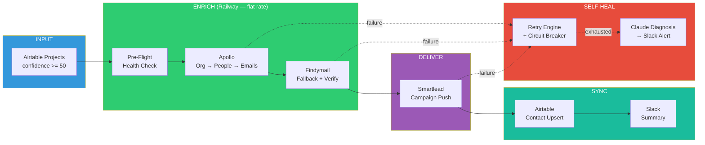

# ECAS Self-Healing Enrichment Pipeline — Visual Architecture

## Mermaid Flowchart (paste into mermaid.live, Notion, or any Mermaid renderer)

```mermaid
flowchart TD
    subgraph TRIGGERS["TRIGGERS — What Starts the Pipeline"]
        T1["Daily Cron<br/>10:00 AM UTC"]
        T2["Hot Signal<br/>Score crosses 55/100"]
        T3["Budget Window<br/>Unlock date = today"]
        T4["Manual API Call<br/>POST /api/enrich-and-enroll"]
        T5["Admin CLI<br/>POST /admin/run/enrich_and_enroll"]
    end

    subgraph PREFLIGHT["PHASE A — Pre-Flight Health Check"]
        direction TB
        PF["Run 5 checks in parallel"]
        PF --> PF1["Apollo API<br/>Search for 'Google'<br/>→ 200 OK?"]
        PF --> PF2["Findymail API<br/>Verify test email<br/>→ 200 OK?"]
        PF --> PF3["Smartlead API<br/>List campaigns<br/>→ 200 OK?"]
        PF --> PF4["Airtable API<br/>Read 1 project<br/>→ 200 OK?"]
        PF --> PF5["Env Vars<br/>All 5 API keys set?"]
        
        PF1 & PF2 & PF3 & PF4 & PF5 --> DECISION{"All healthy?"}
        DECISION -->|"All green"| HEALTHY["STATUS: HEALTHY<br/>Proceed normally"]
        DECISION -->|"Non-critical down<br/>(Findymail/Smartlead)"| DEGRADED["STATUS: DEGRADED<br/>Proceed with warnings<br/>Reduce workers to 1"]
        DECISION -->|"Critical down<br/>(Apollo/Airtable/Env)"| BLOCKED["STATUS: BLOCKED<br/>Stop pipeline<br/>Alert Slack immediately"]
    end

    subgraph STAGE1["STAGE 1 — Get Qualified Projects"]
        S1A["Query Airtable Projects<br/>Filter: confidence_score >= 50<br/>AND owner_company is not empty"]
        S1B["Filter Out Companies<br/>That Already Have Contacts<br/>(dedup check)"]
        S1C{"Any projects<br/>left?"}
        S1A --> S1B --> S1C
        S1C -->|"No projects"| EXIT1["Exit: nothing to do"]
    end

    subgraph STAGE2["STAGE 2 — Enrichment (4 Companies in Parallel)"]
        direction TB
        FAN["Fan-Out: ThreadPoolExecutor<br/>4 workers (1 if degraded)"]
        
        subgraph COMPANY["Per Company (Sequential)"]
            direction TB
            C1["STEP 1: Apollo Org Search<br/>POST /organizations/search<br/>→ Get org_id"]
            C2["STEP 2: Apollo People Search<br/>POST /mixed_people/api_search<br/>→ Candidates by ICP title"]
            C3["STEP 3: Apollo Bulk Match<br/>POST /people/bulk_match<br/>→ Reveal emails (batches of 10)"]
            C4{"Email found<br/>by Apollo?"}
            C5["STEP 4: Findymail Search<br/>POST /api/search<br/>→ name + company domain"]
            C6{"Email found<br/>by Findymail?"}
            C7["STEP 5: Findymail Search #2<br/>POST /api/search<br/>→ name + LinkedIn domain"]
            C8{"Email found?"}
            C9["STEP 6: Findymail Verify<br/>POST /api/verify<br/>→ valid / invalid / catch_all"]
            C10{"Valid?"}
            C11["ACCEPTED<br/>Add to verified contacts"]
            C12["REJECTED<br/>Skip contact"]
            C13["SKIP<br/>No email available"]
            
            C1 --> C2 --> C3 --> C4
            C4 -->|"Yes"| C9
            C4 -->|"No"| C5 --> C6
            C6 -->|"Yes"| C9
            C6 -->|"No"| C7 --> C8
            C8 -->|"Yes"| C9
            C8 -->|"No"| C13
            C9 --> C10
            C10 -->|"Valid"| C11
            C10 -->|"Invalid/Catch-all"| C12
        end

        FAN --> COMPANY
    end

    subgraph RETRY["RETRY ENGINE — Wraps Every API Call"]
        direction TB
        R1["API call fails"]
        R2{"Classify error<br/>by HTTP status"}
        R3["429 Rate Limit<br/>→ Wait Retry-After header<br/>→ Retry (max 4x)"]
        R4["401/403 Auth<br/>→ Alert Slack<br/>→ Do NOT retry<br/>(needs redeploy)"]
        R5["500/502/503 Transient<br/>→ Exponential backoff<br/>2s → 4s → 8s → 16s<br/>→ Retry (max 3x)"]
        R6["402 Credits<br/>→ Alert Slack<br/>→ Do NOT retry<br/>(needs account top-up)"]
        R7["Timeout/Connection<br/>→ Backoff + retry<br/>(max 3x)"]
        R8["4xx Permanent<br/>→ Skip immediately<br/>→ Log error"]
        R9{"Circuit breaker:<br/>5 consecutive<br/>failures?"}
        R10["OPEN circuit<br/>Block all calls<br/>for 5 minutes"]
        R11["Half-open after 5min<br/>Allow 1 test call"]
        
        R1 --> R2
        R2 --> R3 & R4 & R5 & R6 & R7 & R8
        R3 & R5 & R7 --> R9
        R9 -->|"Yes"| R10 --> R11
    end

    subgraph STAGE3["STAGE 3 — Campaign Routing"]
        direction TB
        ROUTE["Parse sector from<br/>project positioning_notes JSON"]
        ROUTEMAP["Sector → Campaign Map:<br/>Power & Grid → 3005694<br/>Data Center & AI → 3040599<br/>Water & Wastewater → 3040600<br/>Industrial & Mfg → 3040601<br/>Defense → 3095136<br/>Drone & Public Safety → 3103531"]
        ROUTE --> ROUTEMAP
    end

    subgraph STAGE4["STAGE 4 — Smartlead Enrollment (Sequential)"]
        direction TB
        CACHE["Pre-cache: Fetch existing leads<br/>per campaign (ONE API call each)<br/>→ Build email set for dedup"]
        LOOP["For each verified contact:"]
        DEDUP{"Email already<br/>in campaign?"}
        ENROLL["POST /campaigns/{id}/leads<br/>→ email, name, company<br/>→ custom fields: title, sector,<br/>   heat_score, enrolled_at"]
        SKIP["Skip (already enrolled)"]
        WAIT["Wait 0.5s<br/>(rate limit buffer)"]
        
        CACHE --> LOOP --> DEDUP
        DEDUP -->|"Yes"| SKIP
        DEDUP -->|"No"| ENROLL --> WAIT
    end

    subgraph STAGE5["STAGE 5 — Airtable Sync"]
        direction TB
        UPSERT["Upsert Contact<br/>Match on: email<br/>Set: first_name, last_name,<br/>title, company_name,<br/>linkedin_url, phone"]
        STATUS["Set outreach_status<br/>= 'in_sequence'"]
        LINK["Link contact to<br/>parent project record"]
        NOTES["Set notes:<br/>Source: Apollo/Findymail<br/>Pipeline | Date | Campaign ID"]
        
        UPSERT --> STATUS --> LINK --> NOTES
    end

    subgraph STAGE6["STAGE 6 — Summary + Diagnosis"]
        direction TB
        SUMMARY["Post to #ecas-signals:<br/>✅ Companies processed: X<br/>✅ Contacts found: Y<br/>✅ Contacts enrolled: Z<br/>📊 Campaign breakdown"]
        
        ERRORS{"Any errors<br/>during pipeline?"}
        DIAG["Claude Diagnosis<br/>(Haiku — fast + cheap)<br/>→ Root cause<br/>→ What was tried<br/>→ Suggested fix<br/>→ Urgency level"]
        ESCALATE["Post to #ecas-signals:<br/>❌ ESCALATION REQUIRED<br/>+ Claude diagnosis<br/>+ Manual retry command"]
        
        ERRORS -->|"No errors"| SUMMARY
        ERRORS -->|"Partial failures"| SUMMARY --> DIAG --> ESCALATE
    end

    %% Main flow connections
    T1 & T2 & T3 & T4 & T5 --> PF
    HEALTHY --> S1A
    DEGRADED --> S1A
    BLOCKED --> ESCALATE
    S1C -->|"Yes"| FAN
    COMPANY --> ROUTE
    ROUTEMAP --> CACHE
    ENROLL --> UPSERT
    NOTES --> ERRORS

    %% Styling
    classDef trigger fill:#4A90D9,stroke:#2E6DB4,color:#fff
    classDef health fill:#27AE60,stroke:#1E8449,color:#fff
    classDef blocked fill:#E74C3C,stroke:#C0392B,color:#fff
    classDef degraded fill:#F39C12,stroke:#D68910,color:#fff
    classDef stage fill:#8E44AD,stroke:#6C3483,color:#fff
    classDef retry fill:#E67E22,stroke:#CA6F1E,color:#fff
    classDef decision fill:#F4D03F,stroke:#D4AC0D,color:#000
    
    class T1,T2,T3,T4,T5 trigger
    class HEALTHY health
    class BLOCKED blocked
    class DEGRADED degraded
    class R10 blocked
    class DECISION,S1C,C4,C6,C8,C10,DEDUP,ERRORS,R2,R9 decision
```



## Simplified Overview Diagram (for presentations)



## Data Flow Table

```
STEP  WHAT HAPPENS                          INPUT                           OUTPUT                          ON FAILURE
────  ──────────────────────────────────   ─────────────────────────────   ─────────────────────────────   ──────────────────────────────
 0    Pre-Flight Health Check               5 API probes (parallel)         healthy / degraded / blocked    BLOCKED → stop + Slack alert
 1    Get Qualified Projects                Airtable projects table         List of companies (max 50)      Empty → exit (no-op)
 2a   Apollo Org Search                     Company name                    org_id                          Retry 3x → skip company
 2b   Apollo People Search                  org_id + ICP titles             Candidate list (max 10)         Retry 3x → skip company
 2c   Apollo Bulk Match                     Person IDs (batches of 10)      Revealed emails                 Retry 3x → try Findymail only
 2d   Findymail Email Search                Name + company domain           Email address                   Skip contact (no email)
 2e   Findymail Verify                      Email address                   valid / invalid / catch_all     Accept with warning on API error
 3    Campaign Routing                      Sector string                   Smartlead campaign ID           Default to Power & Grid (3005694)
 4    Smartlead Enrollment                  Verified contact + campaign ID  Lead in Smartlead               Retry 2x → log error, continue
 5    Airtable Upsert                       Contact data                    Contact record (in_sequence)    Log warning, don't block
 6    Slack Summary                         Results dict                    Message in #ecas-signals        Log to stdout if Slack down
 6b   Claude Diagnosis (if errors)          Error + context + auto-fix log  Root cause + suggested fix      Raw error if Claude unavailable
```

## Retry Strategy Per API

```
API                  ERROR TYPE        STRATEGY                    MAX RETRIES    BACKOFF
─────────────────   ────────────────  ───────────────────────────  ───────────   ──────────
Apollo               429 Rate Limit   Wait Retry-After header      4             Dynamic
Apollo               401/403 Auth     Alert Slack, STOP            0             N/A
Apollo               500-504          Exponential backoff           3             2s→4s→8s
Apollo               Timeout          Retry with same timeout       3             2s→4s→8s
Findymail             429 Rate Limit   Wait + retry                 4             Dynamic
Findymail             402 Credits      Alert Slack, STOP            0             N/A
Findymail             API Error        Accept email unverified       0             N/A
Smartlead             429 Rate Limit   Back off 30s + retry         3             30s
Smartlead             500 Server       Retry + continue batch       2             2s→4s
Smartlead             Duplicate Lead   Success (API handles it)     0             N/A
Airtable              429 Rate Limit   Built-in 0.2s delay          3             2s→4s
Airtable              Any Error        Log warning, continue        0             N/A

CIRCUIT BREAKER:
  After 5 consecutive failures to ANY service → block all calls for 5 minutes
  After 5 minutes → half-open (allow 1 test call)
  Test succeeds → close circuit (resume normal)
  Test fails → re-open for another 5 minutes
```

## Slack Alert Examples

### Success Alert
```
✅ ECAS Enrichment Pipeline — COMPLETE

• Companies processed: 8 (3 skipped)
• Contacts found: 24
• Contacts enrolled: 22
Campaigns:
  • Campaign 3005694: 12 leads
  • Campaign 3040599: 6 leads
  • Campaign 3103531: 4 leads
```

### Degraded Alert
```
⚠️ ECAS Pre-Flight Check — Pipeline running DEGRADED

• findymail: Findymail credits exhausted
```

### Escalation Alert
```
❌ ECAS Pipeline — Escalation Required

ENRICHMENT failed for Quanta Services
Progress: 3/12 companies

ROOT CAUSE: Apollo /people/bulk_match returned 402 Payment Required.
Email reveal credits are exhausted (0 remaining). The key is valid
but the account has no reveal credits left.

WHAT WAS TRIED:
  1. Retried 3x with exponential backoff → same 402
  2. Attempted Findymail-only fallback → found 3/8 contacts

SUGGESTED FIX:
  1. Log into app.apollo.io → Settings → Plan → Add email credits
  2. Pipeline will auto-retry on next scheduled run (10am UTC)

URGENCY: high

Trigger manual retry:
curl -X POST https://ecas-scraper-production.up.railway.app/api/enrich-and-enroll \
  -H "Content-Type: application/json" \
  -d '{"company_filter": "Quanta Services", "min_heat": 0}'
```

### Blocked Alert
```
🛑 ECAS Pre-Flight Check — Pipeline BLOCKED

• apollo: Apollo auth failed (401)
• env_vars: Missing: APOLLO_API_KEY

Pipeline will not run until critical services are restored.
```

## API Endpoints

```
GET  /api/pipeline-health          → Pre-flight check (test all services)
POST /api/enrich-and-enroll        → Run full pipeline (background)
POST /admin/run/enrich_and_enroll  → Same via scheduler admin endpoint
POST /admin/run/enrichment         → Legacy enrichment only (fallback)
POST /admin/run/smartlead          → Legacy enrollment only (fallback)

Request body for /api/enrich-and-enroll:
{
  "min_heat": 50.0,              // Minimum confidence score (default 50)
  "company_filter": null,        // Process only this company (default: all qualified)
  "dry_run": false,              // Find contacts but don't enroll (default: false)
  "titles": null,                // Override ICP title filters (default: from config.py)
  "workers": 4                   // Parallel enrichment workers (default: 4)
}
```

## Trigger Sources

```
SOURCE                  HOW IT CALLS                                              WHEN
──────────────────────  ──────────────────────────────────────────────────────   ────────────────────────
Scheduler Cron          job_enrich_and_enroll() → run_pipeline(min_heat=50)      Daily 10:00 AM UTC
Hot Signal              _check_hot_signal_threshold() → run_pipeline(company=X)  When score crosses 55
Budget Window           job_budget_window_monitor() → run_pipeline(company=X)    When budget unlock = today
Manual API              POST /api/enrich-and-enroll { body }                      Any time
Admin CLI               POST /admin/run/enrich_and_enroll                         Any time
Agent Server            HTTP call to Railway endpoint                              Triggered by agent
Slack Bot               HTTP call to Railway endpoint                              Triggered by command
```

## Tech Stack

```
LAYER           TOOL                    COST        ROLE
──────────────  ──────────────────────  ──────────  ──────────────────────────────────
Compute         Railway                 ~$5-20/mo   Runs all pipeline logic (flat rate)
Lead Data       Apollo.io              Existing     Org search, people search, email reveal
Email Verify    Findymail              Existing     Fallback email find + verification
Sequencing      Smartlead              Existing     Campaign delivery (7 sectors, 6 campaigns)
CRM             Airtable               Existing     Source of truth (projects, contacts, deals)
Alerts          Slack (#ecas-signals)   Existing     Summaries, escalations, health checks
Diagnosis       Claude Haiku           ~$0.01/call  Error root cause analysis
Scheduling      APScheduler (Python)   $0           Cron jobs on Railway server
```
